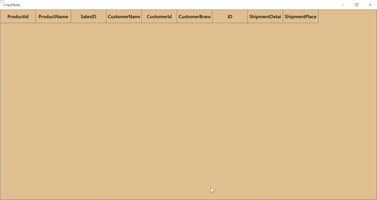

# How to Paste Copied Rows to the Empty UWP DataGrid?

This sample illustrates how to paste copied rows to the empty [UWP DataGrid](https://www.syncfusion.com/uwp-ui-controls/datagrid) (SfDataGrid).

By default, `DataGrid` does not allows you to paste the records from notepad or word when grid is empty. You can achieve this by overriding OnAttached method in SfDataGridBehaviour class.

#### C#
```c#
public class SfDataGridBehavior : Behavior<SfDataGrid>
{
    protected override void OnAttached()
    {
        base.OnAttached();
        this.AssociatedObject.GridCopyPaste = new CustomCopyPaste(this.AssociatedObject);
        this.AssociatedObject.SelectionController = new CustomGridSelectionController(this.AssociatedObject);
        this.AssociatedObject.Loaded += AssociatedObject_Loaded;
    }

    private void AssociatedObject_Loaded(object sender, Windows.UI.Xaml.RoutedEventArgs e)
    {
        this.AssociatedObject.GetVisualContainer().PointerReleased += SfDataGridBehavior_PointerReleased;
    }

    private async void SfDataGridBehavior_PointerReleased(object sender, Windows.UI.Xaml.Input.PointerRoutedEventArgs e)
    {
        await Dispatcher.RunAsync(Windows.UI.Core.CoreDispatcherPriority.Normal,
        () =>
        {
            if (this.AssociatedObject.View != null && this.AssociatedObject.View.Records.Count == 0)
            {
                this.AssociatedObject.Focus(Windows.UI.Xaml.FocusState.Programmatic);
            }
        });
    }
}
```



## Requirements to run the demo
 Visual Studio 2015 and above versions